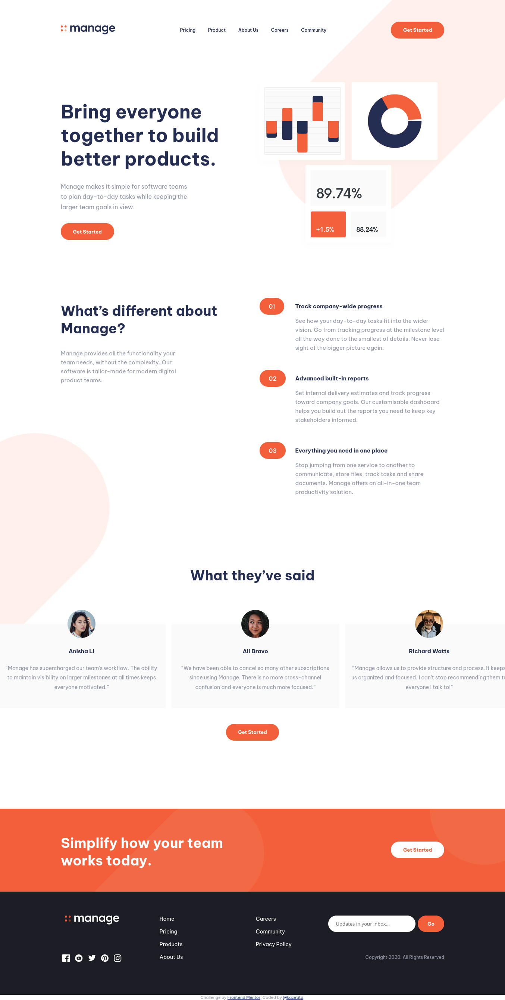

# Frontend Mentor - Manage landing page solution

This is a solution to the [Manage landing page challenge on Frontend Mentor](https://www.frontendmentor.io/challenges/manage-landing-page-SLXqC6P5). Frontend Mentor challenges help you improve your coding skills by building realistic projects. 

## Table of contents

- [Overview](#overview)
  - [The challenge](#the-challenge)
  - [Screenshot](#screenshot)
  - [Links](#links)
- [My process](#my-process)
  - [Built with](#built-with)
  - [What I learned](#what-i-learned)
  - [Continued development](#continued-development)
  - [Useful resources](#useful-resources)

## Overview

### The challenge

Users should be able to:

- View the optimal layout for the site depending on their device's screen size
- See hover states for all interactive elements on the page
- See all testimonials in a horizontal slider
- Receive an error message when the newsletter sign up `form` is submitted if:
  - The `input` field is empty
  - The email address is not formatted correctly

### Screenshot

### Links

- Solution URL: [Frontend Mentor](https://www.frontendmentor.io/solutions/manage-landing-page-with-sassscss-xlrI79rGD)
- Live Site URL: [Preview](https://kazetita.github.io/FEM-Challenge-Manage-Landing-Page/)

## My process

### Built with

- Semantic HTML5 markup
- CSS custom properties
- Flexbox
- CSS Grid
- Mobile-first workflow
- SASS/SCSS

### What I learned
- Make background images scale and reposition depending on screen size.
- Use vainilla javascript to build a slider and make it responsive.
- Combine Sass variables and custom properties.

### Continued development

- Finding an easier technique to make background images responsives.
- Apply a diferent css methodology to organize css, like itcss.

### Useful resources

- [sr-only](https://gist.github.com/ffoodd/000b59f431e3e64e4ce1a24d5bb36034) - This helped me fix accesibility problems in my links.

## Author

- Frontend Mentor - [@kazetita](https://www.frontendmentor.io/profile/kazetita)

